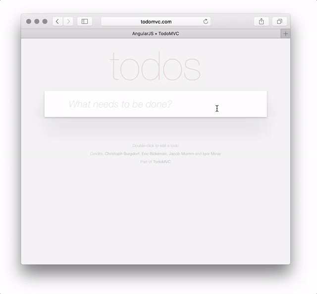

# CucumberJS + Protractor w/ Puppeteer - Starter
###### ES6 / Vanilla Javascript version

Minimalistic template project to kick start Behavior-driven/Gherkin style End-to-End tests automation, written in Screenplay pattern using `cucumberjs` + `protractor` with `puppeteer`.

<a href="http://todomvc.com/examples/vanillajs/"></a>

> **Important!**
>
> To get started with your own Test Automation Project, [**you don't need to clone this repo anymore.**](https://github.blog/2019-06-06-generate-new-repositories-with-repository-templates/) Just click the [`Use this template`](https://github.com/kosalanuwan/todomvc-gherkin-puppeteer/generate) button from the top. To learn more about GitHub Template Projects, visit this [link](https://help.github.com/en/articles/creating-a-repository-from-a-template).

What's included:

- Gherkin style [Features, Backgrounds, Scenarios, Examples with Data tables](https://github.com/kosalanuwan/todomvc-gherkin-puppeteer/tree/master/features), and [Tags with Hooks](https://github.com/kosalanuwan/todomvc-gherkin-puppeteer/tree/master/hooks) to `@skip` / `@ignore` / `@deprecated`
- Written beyond Page Objects and close enough to Screenplay pattern
- Uses our favorite [Todo MVC Web App](http://todomvc.com/examples/vanillajs/) to demo E2E tests
- Provides an [HTML Report](public/report/index.html) with detailed analysis on the test results including screenshots
- Configured to use [`puppeteer`](https://pptr.dev/) framework underneath [`protractor`](https://www.protractortest.org/)
- Configured to run in [`Headless chrome`](https://github.com/kosalanuwan/todomvc-gherkin-puppeteer/tree/master/config)
- Uses ptor plugins to wire [`chai-as-promised`](https://www.chaijs.com/plugins/chai-as-promised/) and `browser` configurations
- Uses [`babel`](https://babeljs.io/videos) to support Modern `javascript` on Node
- Uses [`eslint`](https://eslint.org/) with recommended rules to enforce consistent code style
- Uses [`yarn`](https://yarnpkg.com/en/) scripts for common operations

## Table of Content

- [Quick Start](#quick-start)
  - [Prerequisites](#prerequisites)
  - [Build and run](#build-and-run-from-source)
  - [Available scripts](#available-yarn-scripts)
  - [File structure](#file-structure-of-starter-kit)
- [Contributing](#contributing)
- [Feedback](#feedback)
- [Related Projects](#related-projects)
- [Code of Conduct](#code-of-conduct)
- [License](#license)

## Quick Start

If you want to understand how starter kit works or want to debug an issue or build your automation test suite, you'll want to get the source code, build it, and run it locally.

### Prerequisites

In order to download necessary tools, clone the repo, install dependencies via `yarn`, you need internet access.

You'll need the following tools:

- [Chrome](https://www.google.com/chrome/), version `>=76`
- [Git](https://git-scm.com/downloads)
- [NodeJS](https://nodejs.org/en/download/), x64, version `>=10.15`
- [Yarn](https://yarnpkg.com/lang/en/docs/install/), version `>=1.17`, follow the installation guide
- [Python](https://www.python.org/downloads/), version 2.7
  > macOS ships with Python v2.7. Above link is only for contributors that are not on macOS.
- [JDK](https://www.oracle.com/technetwork/java/javase/downloads/index.html), version `>=8`
- [Visual Studio Code](https://code.visualstudio.com/)
  > Recommended extensions are mentioned in the [`extensions.json`](https://github.com/kosalanuwan/todomvc-gherkin-puppeteer/blob/master/.vscode/extensions.json). This should automatically appear in your Extensions pane once open the code base.

### Build and run from source

First, fork or create a new repo using the starter template. Then, clone your repo locally.

With VS Code:

- Install and build all the dependencies using `yarn`.
```bash
git clone https://github.com/<your-github-account>/todomvc-gherkin-puppeteer
cd todomvc-gherkin-puppeteer
```
- Run `yarn install` to install all the dependencies.
- Run `yarn start` to boot the webdriver manager.
- Run `yarn test` from a new terminal to run tests.

Occasionally, you will want to merge changes in the upstream repo, the official starter kit repo.
```bash
cd todomvc-gherkin-puppeteer
git checkout master
git pull
```
Manage any merge conflicts, commit, and then push them to your upstream repo.

### Available `yarn` scripts

- `install` - install all project dependencies only.
- `start` - update and run the webdriver manager.
- `test` - run all the tests fast in headless mode, and external tests.
- `reset` - remove temp data, cache, and install everything as needed, then run the webdriver-manager for you.
- `prepare` - update and run webdriver-manager for you.
- `test:fast` - run all the tests fast in headless mode.
- `test:direct` - run all the tests in browser.
- `lint` - check for code violations.

### File structure of starter kit
```sh
todomvc-gherkin-puppeteer
│
├── .vscode/                                 # VS Code workspace configurations
│   ├── extensions.json
│   ├── launch.json
│   ├── settings.json
│   └── tasks.json
│
├── actions/                                 # Contains all Interactions
│   ├── helpers/                             # Helper modules and methods
│   │   └── strings.js                       # Example string manipulator for Todos
│   │
│   ├── questions/                           # Questions to ask about the State
│   │   ├── index.js
│   │   └── *.ask.js                         # Example Questions to ask about the state of the Todo app
│   │
│   └── tasks/                               # Steps performed by the Actor
│       ├── index.js
│       └── *.task.js                        # Example Tasks to interact with the Todo app
│
├── config/                                  # Contains all Pptr test configurations
│   ├── config.headless.js                   # Pptr headless configuration
│   └── config.direct.js                     # Pptr direct configuration
│
├── docs/                                    # Contains all documentation
│
├── features/                                # Gherkin style features and scenarios
│   ├── steps/                               # Step definition scripts
│   │   └── *.steps.js                       # Example steps to interact with the Todo app
│   │
│   └── *.feature                            # Example features and scenarios to play
│
├── hooks/                                   # Contains all the hooks for Cucumber
│   ├── capture-screenshot.hook.js           # Capture and attache a screenshot when assertion fails
│   └── skip-or-deprecated.hook.js           # Skip any scenario if tagged as @skip/@ignore/@deprecated
│
├── plugins/                                 # Contains all the Ptor plugins 
│   ├── chai-as-promised.plugin.js           # Plugin to configure chai and chai-as-promised
│   └── ng-optout-browser.plugin.js          # Plugin to configure protractor browser
│
├── public/                                  # Public access folder which can be published if needed
│   └── report                               # Contains all the assets of the test report
│       └── index.html                       # Main page of the test report
│
├── .babelrc                                 # Defines presets for Modern Javascript support
├── .eslintignore                            # Everything that must be excluded from coding styles
├── .eslintrc                                # Defines javascript coding styles
├── .gitignore                               # Everything that must be excluded from the git repo
├── .npmrc                                   # Node configurations for workspace
├── package.json                             # Our javascript and node dependencies
└── README.md                                # This file!
```

## Contributing

There are many ways in which you can participate in the project, for example:

- [Use this template](https://github.com/kosalanuwan/todomvc-gherkin-puppeteer/generate) as a start
- [Submit bugs and feature requests](https://github.com/kosalanuwan/todomvc-gherkin-puppeteer/issues), and help us verify as they are checked in
- Review [source code changes](https://github.com/kosalanuwan/todomvc-gherkin-puppeteer/pulls)
- Review the [documentation](https://github.com/kosalanuwan/todomvc-gherkin-puppeteer/tree/master/docs) and make pull requests for anything from typos to new content

If you are interested in fixing issues and contributing directly to the code base, please see the [Prerequisites](#prerequisites) and [How to build and run from source](#build-and-run).

## Feedback

- Ask a question on [StackOverflow](https://stackoverflow.com/search?tab=newest&q=protractor%20cucumberjs)
- Request a new feature on [GitHub](https://github.com/kosalanuwan/todomvc-gherkin-puppeteer/blob/master/CONTRIBUTING.md)
- Up vote [popular feature requests](https://github.com/kosalanuwan/todomvc-gherkin-puppeteer/issues?q=is%3Aopen+is%3Aissue+label%3Afeature-request+sort%3Areactions-%2B1-desc)
- [File an issue](https://github.com/kosalanuwan/todomvc-gherkin-puppeteer/issues)
- Follow [@alertbox](https://twitter.com/kosalanuwan) and let us know what you think!

## Related Projects

Many of the core components and dependencies live in their own repositories on GitHub. For example, the [`puppeteer`](https://github.com/puppeteer/puppeteer), [`cucumberjs`](https://github.com/cucumber/cucumber-js), and the [`protractor`](https://github.com/angular/protractor) have their own repositories. For a complete list, please have a look at the dependencies on the [`project.json`](https://github.com/kosalanuwan/todomvc-gherkin-puppeteer/blob/master/package.json).

## Code of Conduct

The Alertbox Open Source Conduct is an instantiation of the [TODO Group](https://todogroup.org/) Code of Conduct template, that captures the culture of equality, respect, and inclusion. This same template is used by industry colleagues such as Microsoft, Facebook, Twitter, GitHub, Yahoo, and others in their open source projects.

## License

Copyright (c) Alertbox Inc. All rights reserved.
Licensed under the [MIT](LICENSE) license.